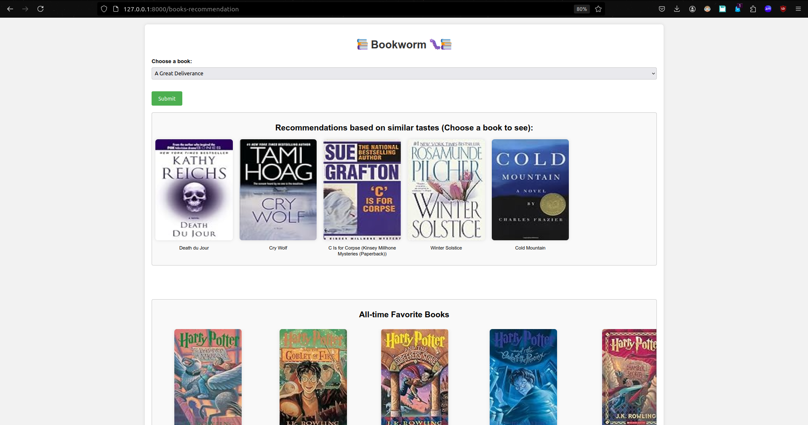

# Bookworm🐛 - Book Recommendation System

This project implements a book recommendation system using two approaches: popularity-based recommendation and collaborative filtering. It includes a web application built with FastAPI for users to interact with the recommendation system.


## Dataset

The dataset used for this project is obtained from Kaggle:
- [Book Recommendation Dataset](https://www.kaggle.com/datasets/arashnic/book-recommendation-dataset)

The dataset consists of three main files:
- `Books.csv`: Contains details about over 2,40,000 books including book ID, title, author, and genre.
- `Ratings.csv`: Contains over 11,49,000 user ratings for the books, with columns including user ID, book ID, and rating.
- `Users.csv`: Contains user information including user ID and location.

## Recommendation Systems Implemented

### 1. Popularity-Based Recommendation System

This system recommends the top 50 books based on their popularity. Specifically, it selects books that have received more than 250 ratings from users.

### 2. Collaborative Filtering Recommendation System

Collaborative filtering recommends books based on similarities between users and/or items. The basic assumption behind the algorithm is that users with similar interests have common preferences. Here :
- Only users who have rated more than 200 books and books that have received more than 50 ratings are considered.
- `Pairwise cosine similarity` is used.
- For a chosen book, the system calculates similarity scores with all other books based on users' ratings and recommends the top 5 most similar books.

## Web Application

The recommendation system is integrated into a web application using FastAPI, a modern web framework for building APIs with Python.

### APIs

1. **/books-recommendation [GET]**:
   - Loads the `index.html` page which displays the result of the popularity-based recommendation system (top 50 books).
   - Includes a dropdown menu listing all books in the dataset. Users select a book and submit.

2. **/books-recommendation [POST]**:
   - Called after the form in the `index.html` page is submitted.
   - Takes the chosen book as a form request parameter and displays collaborative filtering recommendations (top 5 recommendations) for that book.

## How to Run

To run the web application locally:

1. Clone the repository: 
```
git clone https://github.com/priyagupta18/bookworm.git
```
2. Navigate to the webapp directory: 
```
cd webapp
```
3. Install the necessary dependencies (ensure Python and pip are installed): 
``` 
pip install -r requirements.txt
``` 
4. Start the FastAPI server using Uvicorn:
```
uvicorn app:app --reload
```
5. Open a web browser and go to `http://localhost:8000` to interact with the book recommendation system.

## Example Usage

- Visit `http://localhost:8000/books-recommendation` to see the top 50 popular books.
- Select a book from the dropdown menu and submit to get collaborative filtering recommendations.



## Authors

- Priya Gupta

## Acknowledgments

- Kaggle for providing the dataset

## License

- MIT

